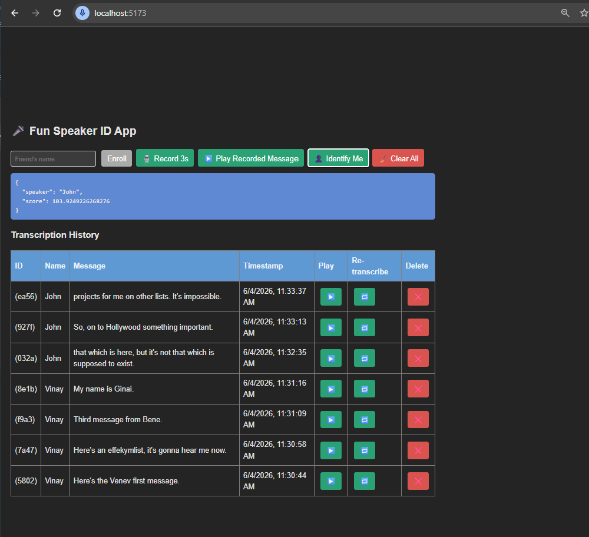

# Speaker Identification App

A simple app designed to identify speakers from audio samples.

* The front-end is a React-based UI
* The back-end is a Python FastAPI.

## Front-End
Provides a user-friendly UI to record audio samples to:
- Register the known users (training data).
- Identify whom a voice belongs to (test data).
- Here's how the UI looks:
  - After recording a few samples,
  - Followed by attempt to identify an user.

### Tech spec:
- **Framework:** React
- **Build Tool:** Vite
- **Language:** TypeScript
- **Key libraries** used:
  - `react` for building UI components
  - `axios` for making HTTP requests to the back-end
  - `vite` for fast development and build processes

## Back-End
The back-end handles audio processing and speaker identification.
- Exposes RESTful endpoints that the front-end communicates with.
- The detailed project architecture:

### Tech spec
- **Framework:** FastAPI
- **Language:** Python
- **Key libraries** used:
  - `fastapi` for API development
  - `uvicorn` for running the server

## Communication

Between the front-end and backend:
- The front-end (UI) communicates with the back-end via HTTP requests.
- User records training audio samples, UI sends audio to Python based FastAPI server.
- The API embeds the audio samples and stores them in a database.
- User records the testing sample - to identify (comparing with the stored users samples.

---

Feel free to explore and use the code, if it helps you!